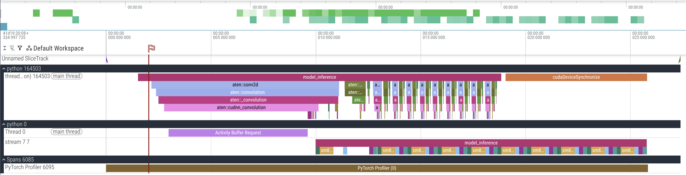
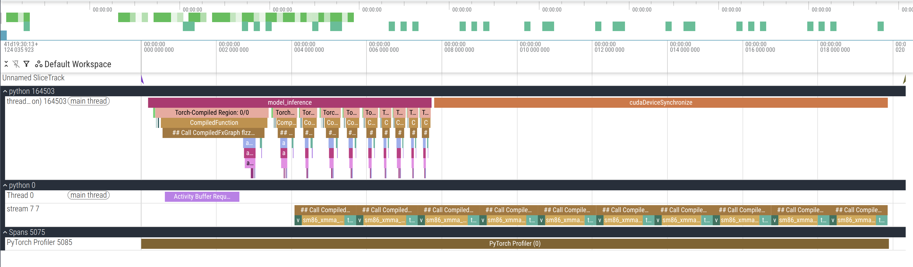

# 2.2 算子融合 (Operator Fusion) 🔗

## 🎯 核心目标
为什么要把 `Conv2d + BN + ReLU` 合并成一个算子？真的只是为了代码简洁吗？No！是为了**减少显存读写**！

## 💡 概念解析

### 1. Kernel Launch Overhead (核启动开销) 🚀
*   每一次 PyTorch 调用 (比如 `c = a + b`)，CPU 都要向 GPU 发送指令，启动一个 kernel。
*   这个启动过程是有开销的 (Overhead)。如果计算量很小 (Element-wise add)，**启动该计算可能比实际计算还要慢**！

#### 📸 CV 工程师类比
*   **Photoshop 脚本:** 你写了一个脚本，要把图片 1. 调亮，2. 锐化，3. 裁剪。
    *   **非融合:** 打开图片 -> 调亮 -> 保存图片 -> 关闭图片 -> 打开图片 -> 锐化 -> ... (太慢了！都在读写硬盘)。
    *   **融合 (Fusion):** 打开图片 -> 在内存里一次性做完调亮+锐化+裁剪 -> 保存图片。

### 2. Vertical Fusion (垂直融合) ↕️
把先后执行的算子合并。
*   **最经典:** `Conv + BN + ReLU` -> `CBR` (Fused Op)。
*   **Pointwise Fusion:** `x * y + z` -> `FMA` (Fused Multiply-Add)。

### 3. Epilogue Fusion (尾部融合) 🐛
*   **Conv + BN:** 数学上的融合。由于 Conv 和 BN 都是线性的，可以把 BN 的参数直接**吸**收进 Conv 的权重里。 `w_new = w * scale / var`。这是一个**静态**的离线融合。
*   **Conv + ReLU:** 计算上的融合。ReLU 是非线性的，不能合并参数。
    *   **原理:** GPU 算完 Conv 的结果 (Accumulator in Register) 后，**不写回显存 (HBM)**。
    *   **直接在寄存器里** 做 `max(0, x)`。
    *   最后才把激活后的结果写回 HBM (High Bandwidth Memory)。
    *   **收益:** 省掉了一次昂贵的 HBM 读写 (Memory Access)。

#### 💡 术语卡片: HBM (High Bandwidth Memory)
*   **全名:** High Bandwidth Memory (高带宽内存)。
*   **地位:** 它是 GPU 的"显存"。相比传统的 GDDR (比如 4090 用的 GDDR6X)，HBM 把内存颗粒直接**堆叠**在 GPU 核心旁边 (CoWoS 封装)。
*   **特点:** 带宽极大 (A100 有 2TB/s)，但容量昂贵。**HBM 是限制 LLM 推理速度的最大瓶颈 (显存墙)**。

### 4. Horizontal Fusion (水平融合) ↔️
把并行执行的算子合并。
*   **Multi-Head Attention:** 计算 Q, K, V 的三个 Linear 层是独立的吗？不！通常会合并成一个大的矩阵乘法 `W_qkv` 一起算。

## ⚔️ 课后实战 (Action Items)
1.  **观察:** 在 PyTorch Profiler 里看一眼。
    *   **运行脚本:** `python ai_infra/chapter_02_pytorch/2.2_fusion_profiler.py`。
    *   **Trace 分析:**
        
        
        *   **Eager Mode (上图):**  **散装。** `Conv2d`, `BatchNorm`, `ReLU` 是分层调用的。你会看到明显的 **空白 (Gap)**：
            1.  **Kernel Launch Overhead:** CPU 正在忙着“走流程”（Python 派发、参数检查、发射 CUDA 指令）。这通常比实际计算还慢。
            2.  **强制同步:** 因为算子独立，数据必须完全写回 **HBM** 落地，下一个才敢开始读。

        
        *   **Compiled Mode (上图):** **套餐。** 只有极少数的大 Kernel (`CompiledFunction`)。Gap 消失了，因为：
            1.  **单次发射:** 多个算子打包成一个大指令发送。
            2.  **原地传球:** 数据直接在寄存器 (Register) 里传递，不回 HBM。
2.  **思考:** 为什么把 `Conv` 和 `ReLU` 融合能减少显存读写？(提示：中间结果不需要写回 Global Memory 了，直接在寄存器里传给下一步)。

### ❓ FAQ: 既然融合这么好，为什么 PyTorch 默认不自动编译？
这是一个关于 **Eager Mode (动态图)** vs **Graph Mode (静态图)** 的经典权衡。

1.  **易用性优先 (Debuggability):** Eager Mode 就像 Python 代码一样，不仅写起来爽，调试也极其方便 (`print`, `pdb`)。编译模式 (Static Graph) 一旦报错，错误栈深不见底，且无法交互调试。
2.  **编译开销 (Compilation Overhead):** 编译是需要时间的 (JIT)。如果只是跑几个 step 或者调试模型，编译可能比运行还慢。
3.  **动态性 (Dynamism):** Python 的动态特性 (`if/else`, dynamic control flow) 很难被编译器完全捕获，可能导致由 "Graph Break" 带来的性能回退。

**结论:** PyTorch 2.0 选择把 `torch.compile` 作为一个**可选的优化开关**，兼顾了开发时的灵活性 (Develop in Eager) 和上线时的性能 (Deploy in Graph)。
