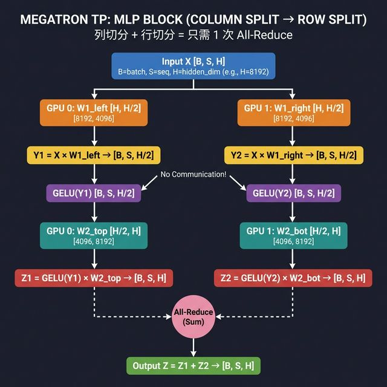

# 2.3 NCCL 通信原语 (Communication Primitives) 📞

## 🎯 核心目标
大模型太大，一张卡放不下。只要涉及多卡，就逃不开通信。NCCL 是 NVIDIA 的通信库，你需要知道这里面的几个关键动词。

## 💡 概念解析

### 1. Point-to-Point (P2P) vs Collective (集合通信) 🗣️
*   **P2P:** 卡 A 发给 卡 B。 `send/recv`。 (一般很少直接用，容易死锁)。
*   **Collective:** 一群卡一起做一件事情。比如大家一起求和。

### 2. 四大天王 (The Big Four) 👑

#### (1) All-Reduce (全归约) ∑
*   **动作:** 每个卡都有自己的数据，大家交换一下，最后每一张卡都得到了 **所有卡的数据之和**。
*   **场景:** **DDP (Distributed Data Parallel)**。每张卡算出自己的梯度，然后 All-Reduce 一下，大家都得到了平均梯度，一起更新参数。
*   **CV 工程师类比:** `SyncBatchNorm` (同步 BN)。你需要统计全局的 Mean/Var。

#### (2) All-Gather (全收集) 🤲
*   **动作:** 每个卡有一部分数据，大家交换一下，最后每一张卡都拥有了 **完整的数据**。
*   **场景:** **ZeRO-3 (DeepSpeed)**。前向传播时，每张卡只有一部分参数，需要 All-Gather 把完整参数拿过来，算完了再丢掉。

#### (3) Reduce-Scatter (归约散播) 🧩
*   **动作:** 大家都有完整的数据（或者部分数据），求和之后，结果**分散**在每张卡上。
*   **场景:** **ZeRO-1/2 (DeepSpeed)**。梯度求和之后，我只负责更新我那一部分参数，不需要知道完整梯度。

#### (4) Broadcast (广播) 📢
*   **动作:** 卡 0 有数据，发给所有人。
*   **场景:** 初始化训练时，把卡 0 的随机初始化权重同步给所有人，保证起点一致。

### 📊 四大天王对比表

假设有 4 张 GPU，每张卡持有数据 `A`, `B`, `C`, `D`：

| 原语 | 操作前 (每张卡) | 操作 | 操作后 (每张卡) | 通信量 |
|---|---|---|---|---|
| **All-Reduce** | GPU0=A, GPU1=B, GPU2=C, GPU3=D | 求和 + 广播 | **每张卡都有** A+B+C+D | 2(N-1)/N × 数据量 |
| **All-Gather** | GPU0=A, GPU1=B, GPU2=C, GPU3=D | 拼接 + 广播 | **每张卡都有** [A,B,C,D] | (N-1)/N × 数据量 |
| **Reduce-Scatter** | GPU0=A, GPU1=B, GPU2=C, GPU3=D | 求和 + 分散 | GPU0=sum的1/4, GPU1=sum的2/4, ... | (N-1)/N × 数据量 |
| **Broadcast** | GPU0=A, 其他为空 | 复制 | **每张卡都有** A | 数据量 |

> 💡 **记忆口诀:**
> - **All-Reduce** = Reduce-Scatter + All-Gather (先求和分散，再收集完整)
> - **All-Gather** = 大家凑一桌菜，每人都能吃到所有菜
> - **Reduce-Scatter** = 大家把菜混在一起，但每人只分到一份
> - **Broadcast** = 老板请客，只有他出菜

### 3. 底层拓扑：Ring vs Tree 🔄🌳

上面讲的是"做什么" (All-Reduce, All-Gather...)，这里讲的是"怎么做"——数据在 GPU 之间以什么路径传递。

#### Ring (环形) 🔄
```
GPU0 → GPU1 → GPU2 → GPU3 → GPU0  (首尾相连)
```
*   **过程:** 数据切成 N 份，沿环传递 N-1 轮。每轮每张卡发送 `D/N` 给邻居。
*   **优点:** 带宽利用率**最优**，每条链路都在满载传输。
*   **缺点:** 延迟 `O(N)`，GPU 越多轮数越多。
*   **适合:** 单机少卡 (≤16)，数据量大。

#### Tree (树形) 🌳
```
        GPU0 (Root)
       /          \
    GPU1          GPU2
   /    \        /    \
 GPU4  GPU5   GPU6  GPU7
```
*   **过程:** Reduce 阶段从叶子往根汇聚求和；Broadcast 阶段从根往叶子广播。
*   **优点:** 延迟 `O(log N)`，GPU 再多也就几轮。
*   **缺点:** 根节点附近带宽压力大（瓶颈）。
*   **适合:** 跨机多卡 (>16)，延迟敏感、数据量小。

#### 📊 Ring vs Tree 对比

| | Ring 🔄 | Tree 🌳 |
|---|---|---|
| **延迟** | O(N) 高 | O(log N) **低** ✅ |
| **带宽** | **最优** ✅ | 根节点瓶颈 |
| **适合** | 单机少卡，大数据量 | 跨机多卡，小数据量 |
| **NCCL 策略** | 机内默认使用 | 跨机自动切换 |

> 💡 **面试一句话:** "Ring 追求带宽最优，Tree 追求延迟最低。NCCL 会根据数据量和拓扑自动选择——小数据用 Tree 减延迟，大数据用 Ring 吃满带宽。"

## ⚔️ 课后实战 (Action Items)
1.  **画图:** 拿张纸，画 4 个方块代表 GPU。试着画出 Ring All-Reduce 的两步走 (Reduce-Scatter + All-Gather)。
2.  **思考:** 为什么 TP (Tensor Parallel) 里一定要用 All-Reduce？(提示：矩阵切分乘法之后，部分和需要累加才能得到最终结果)。
    *   **答案:** 想象一下矩阵乘法 `Y = X * W`。TP 把大矩阵 `W` 切成了两半 `W1` 和 `W2` (列切分)。
    *   GPU 1 算出 `Y1 = X * W1`，GPU 2 算出 `Y2 = X * W2`。这时候如果你要做下一个 Linear 层 (行切分)，你需要的是完整的 `Y`。
    *   通常 TP 的做法是：第一个 Linear 做列切分 (得到部分结果 `Y1`, `Y2`concat 起来是完整的 Y)，第二个 Linear 做行切分 (输入必须是完整的 Y 吗？不，输入切分，权重行切分 -> 输出部分和 `Z1`, `Z2`)。
    *   **关键点:** 在第二个 Linear 算完后，GPU 1拥有部分和 `Z1`，GPU 2 拥有部分和 `Z2`。真正的 `Z = Z1 + Z2`。
    *   **所以:** 需要 **All-Reduce (Sum)** 把所有 GPU 上的部分和加起来，让每个 GPU 都得到完整的 `Z`，才能继续下一层。



## 🎤 面试高频问答 (Interview FAQ)

### Q1: "DDP 训练时梯度是怎么同步的？"
**答:** 每张卡独立做 Forward + Backward，算出各自的梯度。然后通过 **All-Reduce** 将所有卡的梯度求和取平均。这样每张卡都拥有了相同的平均梯度，各自更新参数后依然保持一致。

#### 📐 数学等价性证明
DDP 多卡求均值 **严格等于** 单卡大 Batch 的梯度。

假设总 Batch = `B`，`N` 张卡各分到 `B/N` 个样本：
```
单卡:  ∇L = (1/B) × Σ(i=1..B) ∇l_i

DDP:   每张卡 k 算局部梯度 g_k = (1/(B/N)) × Σ ∇l_j
       All-Reduce 求平均:
       ∇L_ddp = (1/N) × Σ(k=0..N-1) g_k
             = (1/N) × (N/B) × Σ(i=1..B) ∇l_i
             = (1/B) × Σ(i=1..B) ∇l_i
             = ∇L  ✅ 完全一致！
```

> ⚠️ **实际中的"不等价"陷阱:**
> | 因素 | 原因 |
> |---|---|
> | **浮点精度** | 加法顺序不同导致舍入误差 (FP16 尤其明显) |
> | **BatchNorm** | 没用 `SyncBatchNorm` 时，每张卡只统计局部 Mean/Var |
> | **Dropout** | 每张卡随机种子不同，但这是期望行为 |

### Q2: "Megatron TP 里为什么需要通信？用的是什么原语？"
**答:** 因为 TP 把权重矩阵切分了（列切分 + 行切分）。行切分后每张卡只算出了结果的**部分和**，需要 **All-Reduce (Sum)** 把部分和加起来，才能得到完整输出继续下一层。

### Q3: "ZeRO-3 前向传播时参数怎么来的？"
**答:** ZeRO-3 把模型参数分散存储在各张卡上。前向传播到某一层时，通过 **All-Gather** 临时把该层的完整参数拼回来，算完后立刻丢掉，只保留自己负责的那一份。这样每张卡只需要 1/N 的参数显存。

### Q4: "All-Reduce 和 Reduce-Scatter 有什么区别？"
**答:** 
*   **All-Reduce:** 求和后**每张卡都有完整结果**。适合 DDP（每人都要完整梯度来更新）。
*   **Reduce-Scatter:** 求和后**每张卡只拿到结果的 1/N**。适合 ZeRO（每人只更新自己负责的参数分片，不需要完整梯度）。
*   本质上：**All-Reduce = Reduce-Scatter + All-Gather**。

### Q5: "通信是训练的瓶颈吗？怎么优化？"
**答:** 是的，通信经常是多卡训练的瓶颈（通信墙）。优化手段：
1.  **通信与计算重叠 (Overlap):** 一边算下一层，一边传上一层的梯度。
2.  **梯度压缩/量化:** 传 FP16 甚至 INT8 的梯度，减少通信量。
3.  **拓扑感知:** 同机内用 NVLink (900GB/s)，跨机用 InfiniBand (400Gb/s)。优先在高带宽链路上做大量通信。

### 📋 场景速查表

| 面试场景 | 用什么原语 | 一句话原因 |
|---|---|---|
| DDP 同步梯度 | All-Reduce | 每人都要完整梯度才能更新 |
| TP 合并部分和 | All-Reduce | 矩阵切分后要加起来 |
| ZeRO-3 取参数 | All-Gather | 参数分散，前向需要完整的 |
| ZeRO-1/2 分梯度 | Reduce-Scatter | 每人只更新自己那部分 |
| 训练初始化 | Broadcast | 保证所有卡起点一致 |
