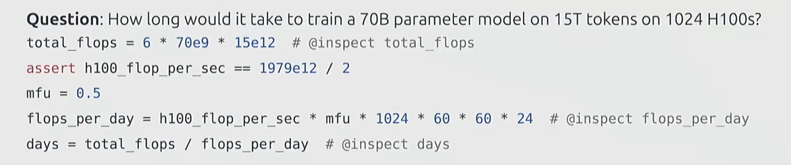

这是一道非常经典的  **AI Infra 面试题** ，通常被称为  **"Back-of-the-envelope Calculation" (信封背面的估算)** 。

在实际工作中，当你老板问你：“我们要训一个 70B 的模型，给我批 1000 张 H100 够不够？要训多久？”，你必须能立刻拿起笔并在几分钟内算出这个答案。

这张图里的代码就是在做这件事。我们逐行拆解，看看里面的  **Infra 核心逻辑** 。

---

### 1. 核心公式：算力需求 (Demand)

**Python**

```
total_flops = 6 * 70e9 * 15e12
```

* **公式来源：** 这是大模型训练估算的黄金定律 ——  **$6PD$ 估算法** 。
  * **$C \approx 6 \times P \times D$**
  * **$C$**: 总计算量 (Total FLOPs)。
  * **$P$**: 模型参数量 (Parameters) = **$70 \times 10^9$** (70B)。
  * **$D$**: 训练数据量 (Dataset Tokens) = **$15 \times 10^{12}$** (15T Tokens)。
* **为什么是 6？** (面试必考 🔥)
  * **前向传播 (Forward Pass):** 大约需要 **$2P$** 次浮点运算（矩阵乘 `Y = XW`，每个输出元素一次乘法一次加法）。
  * **反向传播 (Backward Pass):** 大约需要 **$4P$** 次浮点运算，是前向的 **2 倍**。因为要算**两个梯度**，每个都是一次和前向同等规模的矩阵乘：
    * ① 算输入的梯度 `dX = dL/dY @ W^T` → **$2P$** FLOPs （用来把梯度继续往前传 🔙）
    * ② 算权重的梯度 `dW = X^T @ dL/dY` → **$2P$** FLOPs （用来更新权重 ⚖️）
    * ⚠️ 注意：权重更新本身 `W = W - lr * dW` 只是逐元素运算 O(P)，相比矩阵乘可忽略不计，不算在 6PD 里。
  * **合计：** **$2P + 4P = 6P$** FLOPs/token。
* **为什么再乘以 D？为什么是乘法？** 🤔
  * `6P` 是处理 **一个 Token** 的计算量，你有 **D 个 Token** 要训练。
  * 每个 Token 都要**独立地**跑一遍完整的前向 + 反向：
    ```
    Token_1: Forward(2P) + Backward(4P) = 6P
    Token_2: Forward(2P) + Backward(4P) = 6P
    ...
    Token_D: Forward(2P) + Backward(4P) = 6P
    ─────────────────────────────────────────
    总计: D 个 6P 加起来 = 6P × D
    ```
  * 📸 类比：洗车店洗一辆车要 6 个步骤 (6P)，今天来了 D 辆车，总工作量就是 `6 × D` 🚗
  * ⚠️ 虽然实际训练是按 Batch 跑的（多个 Token 一起做矩阵乘），但**总 FLOPs 不变** —— 矩阵变大了，次数变少了，总量一样。

### 2. 硬件算力：单卡理论性能 (Supply - Theoretical)

**Python**

```
assert h100_flop_per_sec == 1979e12 / 2
```

* **1979e12 (1979 TFLOPS):** 这是 NVIDIA H100 SXM5 的官方宣称峰值性能 (FP16/BF16 Tensor Core)。
* **为什么要除以 2？ (关键点)**
  * NVIDIA 宣传的 1979 TFLOPS 通常指的是 **Sparse (稀疏)** 性能（利用了 Structural Sparsity 特性）。
  * 但在实际预训练（Pre-training）中，为了保证模型质量，我们通常使用的是 **Dense (稠密)** 计算。
  * 稠密算力通常是稀疏算力的一半。所以这里除以 2，得到 **~989 TFLOPS** 的  **Dense BF16/FP16 理论峰值** 。

### 3. 效率打折：MFU (Model FLOPs Utilization)

**Python**

```
mfu = 0.5
```

* **定义：** **MFU** 是衡量 Infra 系统优化水平的最重要指标。
* **含义：** 虽然 H100 理论上每秒能跑 989 TFLOPS，但你不可能跑满。
  * 显存带宽瓶颈 (Memory Wall)
  * 卡间通信开销 (Communication Overhead, All-Reduce)
  * 流水线气泡 (Pipeline Bubbles)
  * 算子启动开销 (Kernel Launch)
* **数值解读：**
  * **0.5 (50%)** 是目前 **H100 集群** 上一个非常优秀的工业界标准（通常在 40%-60% 之间）。如果你能优化到 60% 以上，你就是顶级的 Infra 专家。
  * 在 A100 时代，MFU 通常在 30%-40% 左右。

### 4. 集群吞吐量 (Throughput)

**Python**

```
flops_per_day = h100_flop_per_sec * mfu * 1024 * 60 * 60 * 24
```

* 这一步是在算：**这 1024 张卡火力全开（考虑了效率折扣后），一天能算多少次浮点运算？**
* 单位换算：秒 -> 天。

### 5. 最终结果 (Time)

**Python**

```
days = total_flops / flops_per_day
```

* **总工作量 / 每天的工作能力 = 需要的天数。**

---

### 🧮 让我们手算一下（Infra 必须对数字敏感）

1. **需求 (Total FLOPs):**
   **$6 \times 70 \times 10^9 \times 15 \times 10^{12} = 6300 \times 10^{21} = 6.3 \times 10^{24} \text{ FLOPs}$** (也就是 6.3 ZettaFLOPs)。
2. **供给 (Daily Effective FLOPs):**
   * 单卡有效算力：**$989 \text{ TFLOPS} \times 0.5 \approx 500 \text{ TFLOPS} = 5 \times 10^{14} \text{ FLOPs/s}$**
   * 集群每秒算力：**$5 \times 10^{14} \times 1024 \approx 5 \times 10^{17} \text{ FLOPs/s}$** (0.5 ExaFLOPs/s)
   * 集群每天算力：**$5 \times 10^{17} \times 86400 \approx 4.3 \times 10^{22} \text{ FLOPs/day}$**
3. **天数:**
   **$6.3 \times 10^{24} / 4.3 \times 10^{22} \approx 146 \text{ 天}$**

**结论：** 用 1024 张 H100 训练这个模型，大约需要  **146 天** （接近 5 个月）。

> **💡 面试加分项：**
>
> 如果面试官问你：“这时间太长了，怎么加速？”
>
> 你不能只回答“加卡”。你要回答：
>
> 1. **算法层面：** 用  **Curriculum Learning** ，先训简单数据？或者用 **MoE (Mixture of Experts)** 架构，同参数量下计算量只有 70B Dense 的 1/4 左右。
> 2. **Infra 层面：** 优化 MFU。看看是不是通信卡住了？能不能上  **FlashAttention-3** ？能不能优化 **Checkpointing** 策略？
> 3. **硬件层面：** 换 FP8 训练（H100 强项），算力翻倍，时间减半。

这道题你理解了吗？这基本上是 Infra 岗位容量规划（Capacity Planning）的入门测试。
