# 3.1 KV Cache (Key-Value Cache) 🔑

## 🎯 核心目标
为什么大模型推理这么吃显存？因为我们要存 **KV Cache**。

## 💡 概念解析

### 0. LLM 推理架构与流程 (Architecture & Flow) 🗺️
在深入 KV Cache 之前，先看一张图，理解 LLM 是如何处理输入并生成输出的。

```mermaid
graph TD
    subgraph Prefill [Phase 1: Prefill]
        P_Input[/"Input Prompt"/]
        P_Embed["Embedding"]
        P_L0_Op["Compute L0"]
        P_KV0[("Write KV0")]
        P_L1_Op["Compute L1"]
        P_KV1[("Write KV1")]
        P_Ln_Op["Compute ..."]
        P_Out[/"First Token"/]

        P_Input --> P_Embed
        P_Embed --> P_L0_Op
        P_L0_Op --> P_KV0
        P_L0_Op --> P_L1_Op
        P_L1_Op --> P_KV1
        P_L1_Op --> P_Ln_Op
        P_Ln_Op --> P_Out
    end

    subgraph Decode [Phase 2: Decode]
        D_Input[/"Last Token"/]
        D_Embed["Embedding"]
        
        D_L0_Op["Compute L0"]
        D_L0_KV[("Read KV0")]
        D_KV0_New[("Write KV0")]
        
        D_L1_Op["Compute L1"]
        D_L1_KV[("Read KV1")]
        D_KV1_New[("Write KV1")]
        
        D_Ln_Op["Compute ..."]
        D_Out[/"Next Token"/]

        D_Input --> D_Embed
        D_Embed --> D_L0_Op
        D_L0_KV -.-> D_L0_Op
        D_L0_Op --> D_KV0_New
        D_L0_Op --> D_L1_Op
        
        D_L1_KV -.-> D_L1_Op
        D_L1_Op --> D_KV1_New
        D_L1_Op --> D_Ln_Op
        
        D_Ln_Op --> D_Out
        D_Out -- "Loop" --> D_Input
    end

    subgraph Model [LLM Architecture]
        L0["Layer 0"]
        L1["Layer 1"]
        Ln["Layer N"]
        
        L0 --> L1
        L1 -.-> Ln
    end

    style Prefill fill:#e6fffa,stroke:#00b894
    style Decode fill:#e3f2fd,stroke:#0984e3
    style Model fill:#dfe6e9,stroke:#636e72
```

### 1. 什么是 KV Cache? 🤔
在 Transformer 的自回归 (Auto-regressive) 生成过程中，为了避免重复计算已经生成过的 token 的 Key 和 Value 矩阵，我们将它们缓存下来。
Attention 机制本身是 O(N^2) 的，但因为是 Causal (只能看过去)，我们可以复用之前的计算结果。

### 2. 推理的两大阶段 (The Two Phases) ✌️
LLM 推理并不是从头到尾都一样的，它分为两个截然不同的阶段：

#### 🟢 Phase 1: Prefill (预填充 / Prompt Processing)
*   **What:** 处理用户输入的 Prompt (提示词) 的阶段。
*   **Action:** 一次性并行计算所有 Prompt token 的 KV Cache。
*   **特点 (Compute Bound):** 因为是并行矩阵乘法 (GEMM)，且一次性处理很多 token，计算密度高，主要受限于 GPU 计算能力 (TFLOPS)。
*   **Latency:** 也就是 **Time to First Token (TTFT)**。

#### 🔵 Phase 2: Decode (解码 / Token Generation)
*   **What:** 一个接一个生成新 token 的阶段。
*   **Action:** 每次只生成 1 个 token，依赖上一步的 KV Cache。
*   **特点 (Memory Bound):** 每次都要搬运巨大的 KV Cache 到计算单元，但只计算这 1 个 token。主要受限于 **显存带宽 (Memory Bandwidth)**。
*   **Latency:** 也就是 **Time Per Output Token (TPOT)**。

### 3. 为什么需要它? (The Why)
如果不缓存，每生成一个新词，都要把之前所有的词重新算一遍 Attention。
*   生成第 1000 个词：计算量 1000。
*   生成第 1001 个词：计算量 1001。
*   总复杂度: O(N^2)。慢得像乌龟 🐢。

如果缓存了 (KV Cache)：
*   生成第 1000 个词：只算这 1 个新词的和前面 999 个 cached K/V 的 Attention。
*   总复杂度: O(N)。飞快 🐇。

#### 📸 CV 工程师类比
*   **Video Object Tracking (视频目标跟踪):**
    *   **Naive 方法:** 每来一帧新图像，你都把 *从第一帧到当前帧* 的所有图像重新输入 CNN 提取特征。 -> 显卡冒烟 💥。
    *   **KV Cache 方法:** 你只计算 *新的一帧* 的特征，并复用之前保存下来的特征图 (Feature Maps) 更新状态 (Hidden State)。
    *   **区别:** CV 的特征图大小通常固定 (如 `H x W`)，但在 LLM 中，随着生成 token 增加，KV Cache 的**序列长度 (Sequence Length) 是不断增长的** 📈。

## ⚔️ 课后实战 (Action Items)
1.  **算一算:** Llama-2-7B (float16) 存一个 token 的 KV Cache 需要多少显存？
    *   公式: `2 (K+V) * n_layers * n_heads * head_dim * sizeof(float16)`
    *   Llama-2-7B: 32 layers, 32 heads, 128 dim.
    *   `2 * 32 * 32 * 128 * 2 bytes = 524,288 bytes` ≈ **0.5 MB / token**。
    *   如果你有 2048 context length，一个用户就要吃掉 1GB 显存！User * Batch，显存瞬间爆炸 💥。

### 4. 常见疑问：为什么不把 KV Cache 放在寄存器 (Register) 里？ 🤔
这是一个非常好的计算机体系结构问题！答案很简单：**放不下**。

让我们看一组数据对比 (以 NVIDIA A100 80GB 为例)：

*   **Register File 大小:**
    *   每个 SM (Streaming Multiprocessor) 有 256 KB 寄存器堆。
    *   A100 有 108 个 SM。
    *   **全卡总寄存器容量:** `108 * 256 KB ≈ 27 MB`。
*   **KV Cache 大小:**
    *   如上计算，1 个用户的 sequence length 达到 2048 时，KV Cache 大小约为 **1 GB**。
    *   `1 GB (KV Cache) >> 27 MB (Total Registers)`。

**结论:** 寄存器虽然速度最快 (比 HBM 快 100 倍以上)，但容量极小，只能存放当前正在计算的几个数 (Operands)。KV Cache 这种海量数据只能存放在容量最大的 **HBM (High Bandwidth Memory)** 中，这就是为什么 LLM 推理是 **Memory Bound** 的根本原因。

### 5. 常见疑问：为什么每一层都要存 KV Cache？难道不能只存第一层吗？ 🤔
这是一个非常经典的问题，尤其是对于熟悉 BERT (Encoder-only) 的同学来说。

*   **误区:** 只有第一层处理原始 Token，后面的层处理的都是中间特征，所以是不是只要算出第一层，后面都能推导出来？
*   **真相:** **每一层的 K 和 V 都是不一样的！**

#### 推理链条 🔗
1.  **Layer 0:** 输入 Token -> 乘以 $W_{k0}, W_{v0}$ -> 得到 $K_0, V_0$。
2.  **Layer 1:** 输入是 Layer 0 的输出 -> 乘以 $W_{k1}, W_{v1}$ -> 得到 $K_1, V_1$。
3.  **计算依赖:** 如果你要计算第 100 个 token 在 Layer 1 的输出，你需要 Layer 1 的 $K_1, V_1$ (包含前 99 个 token 的历史信息)。
4.  **如果不存会怎样？**
    *   如果你没存 Layer 1 的 $K_1, V_1$，你只存了 Layer 0 的。
    *   为了得到 Layer 1 的输入，你必须**重新运行** Layer 0 的计算。
    *   为了得到 Layer 2 的输入，你必须**重新运行** Layer 0 和 Layer 1 的计算。
    *   **结果:** 你不仅没省计算，反而回到了 $O(N^2)$ 的地狱，每次生成新 token 都要把前面所有层的网络重新跑一遍！

**总结:** 每一层的 feature map 都是这个 token 在不同语义空间 (Semantic Space) 的表示。为了实现 O(1) 的生成速度，我们必须把**每一层、每一个历史 token** 的状态都拍成快照 (Snapshot) 存下来。这就是 KV Cache 如此庞大的原因。
